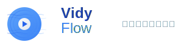

# VidyFlow - 现代化视频下载器

<div align="center">
  
  
  <p>一个基于 Electron + React + TypeScript 的现代化视频下载器</p>
  <p>支持多平台视频下载，具有实时进度显示和智能音视频合并功能</p>
</div>

---

## ✨ 特性

- 🎬 **多平台支持** - 基于 yt-dlp，支持 YouTube、Bilibili 等主流视频平台
- 📊 **实时进度** - 智能进度管理，显示下载阶段和文件大小
- 🎵 **音视频合并** - 自动合并音频和视频为完整的 MP4 文件
- 🎯 **质量选择** - 支持多种视频质量选择（720p、1080p 等）
- 📝 **下载历史** - 完整的下载记录管理
- 🎨 **现代化 UI** - 简洁美观的用户界面，基于 Tailwind CSS

## 🚀 快速开始

### 环境要求

- Node.js 18+
- Yarn 1.22+
- yt-dlp (需要在系统 PATH 中)

### 安装 yt-dlp

```bash
# macOS (使用 Homebrew)
brew install yt-dlp

# Windows (使用 Chocolatey)
choco install yt-dlp

# 或者直接下载二进制文件
# https://github.com/yt-dlp/yt-dlp/releases
```

### 运行项目

```bash
# 克隆项目
git clone <repository-url>
cd vidyflow

# 安装依赖
yarn install

# 启动开发服务器
yarn start
```

## 🛠️ 开发

### 可用脚本

```bash
# 启动开发服务器
yarn start

# 代码检查
yarn run lint
yarn run type-check

# 格式化代码
yarn run format

# 构建应用
yarn run make
```

### 技术栈

- **前端**: React 19 + TypeScript 5 + Tailwind CSS 3
- **桌面应用**: Electron 36 + Electron Forge
- **构建工具**: Vite 5
- **代码规范**: ESLint + Prettier
- **包管理**: Yarn

## 📚 文档

详细的项目文档位于 `docs/` 目录：

- **[完整文档索引](./docs/README.md)** - 所有文档的导航和概述
- **[修复日志](./docs/fixes/)** - 问题修复和改进记录
- **[设置指南](./docs/setup/)** - 环境配置和设置说明

### 常见问题

- **下载失败** → 查看 [权限修复文档](./docs/fixes/01-permission-fix.md)
- **进度不显示** → 查看 [进度修复文档](./docs/fixes/03-progress-fix.md)
- **音视频分离** → 查看 [进度修复文档](./docs/fixes/03-progress-fix.md)

## 🎯 使用方法

1. **输入视频链接** - 在输入框中粘贴视频 URL
2. **获取视频信息** - 点击"获取"按钮解析视频信息
3. **选择设置** - 选择下载路径和视频质量
4. **开始下载** - 点击"开始下载"并观察实时进度
5. **查看历史** - 在下载历史中管理已下载的文件

## 🏗️ 项目架构

```
vidyflow/
├── src/
│   ├── main.ts          # 主进程 - Electron 主要逻辑
│   ├── preload.ts       # 预加载脚本 - 安全的 IPC 通信
│   ├── renderer.tsx     # 渲染进程入口
│   ├── App.tsx          # React 主组件
│   ├── global.d.ts      # 全局类型定义
│   └── index.css        # Tailwind CSS 样式
├── docs/                # 项目文档
├── forge.config.ts      # Electron Forge 配置
├── vite.*.config.ts     # Vite 配置文件
└── 其他配置文件...
```

## 🔧 核心功能实现

### 进度管理

- 阶段化进度跟踪（准备→视频→音频→合并→完成）
- 基于权重的总体进度计算，避免进度倒退
- 实时文件大小和下载速度显示

### 音视频合并

- 智能格式选择器：`bestvideo+bestaudio/best`
- 自动使用 ffmpeg 进行音视频合并
- 支持多种质量和格式选择

### 用户界面

- 响应式设计，支持不同窗口大小
- 实时状态反馈和错误处理
- 简洁直观的操作流程

## 🤝 贡献

欢迎提交 Issue 和 Pull Request！

1. Fork 项目
2. 创建功能分支 (`git checkout -b feature/AmazingFeature`)
3. 提交更改 (`git commit -m 'Add some AmazingFeature'`)
4. 推送到分支 (`git push origin feature/AmazingFeature`)
5. 开启 Pull Request

## 📄 许可证

本项目采用 MIT 许可证 - 查看 [LICENSE](LICENSE) 文件了解详情。

## 🙏 致谢

- [yt-dlp](https://github.com/yt-dlp/yt-dlp) - 强大的视频下载工具
- [Electron](https://electronjs.org/) - 跨平台桌面应用框架
- [React](https://reactjs.org/) - 用户界面库
- [Tailwind CSS](https://tailwindcss.com/) - 实用优先的 CSS 框架

---

_如果这个项目对你有帮助，请给它一个 ⭐️！_
